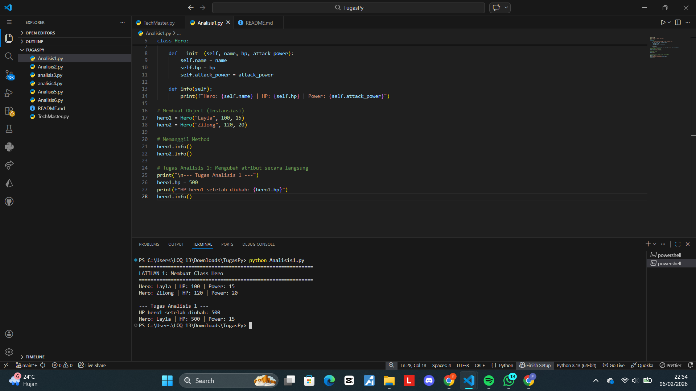
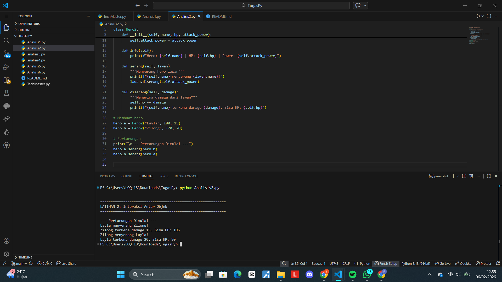
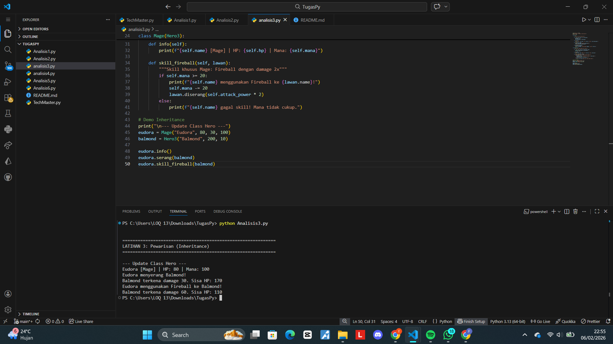
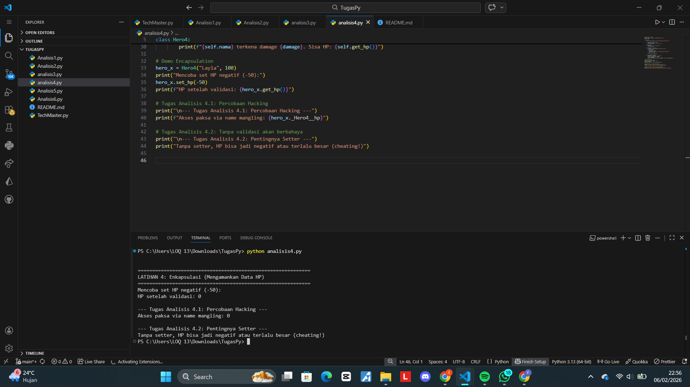
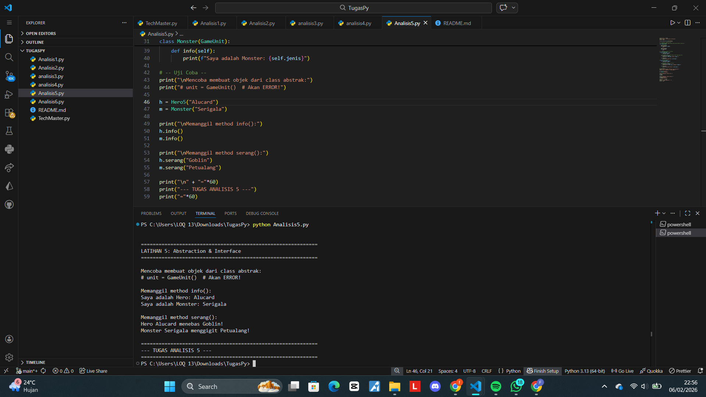
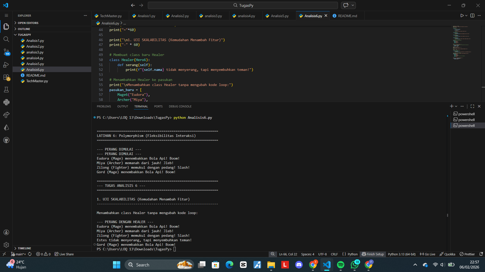

# Jawaban Tugas OOP – TechMaster

===========================================================================================

## Jawaban Tugas Analisis 1–6

### Analisis 1

Kalau `hero1.hp` diubah jadi `500` setelah objek dibuat, nilainya langsung ikut berubah.  
Karena atribut tersebut milik objek dan bisa diakses langsung.  
Jadi saat `print(hero1.hp)` dijalankan, output yang muncul adalah `500`.

---

### Analisis 2

Parameter `lawan` merupakan sebuah objek utuh, bukan hanya nama atau string.  
Hal ini penting karena objek tersebut memiliki data dan method yang bisa langsung digunakan (seperti HP dan method serang).  
Jika hanya berupa string, objek tidak bisa berinteraksi secara langsung.

---

### Analisis 3

Ketika `super()` dihapus, atribut dari class induk (`Hero`) seperti `name` tidak ikut dibuat.  
Akibatnya muncul error *object has no attribute*.  
Fungsi `super()` digunakan sebagai penghubung agar data dari parent class bisa digunakan di child class.

---

### Analisis 4

Atribut HP masih bisa ditampilkan walaupun bersifat private karena Python menggunakan *name mangling*.  
Namun cara ini tidak disarankan karena melanggar konsep keamanan data.  

Tanpa validasi pada setter, nilai HP bisa menjadi negatif.  
Setter digunakan untuk memastikan data tetap valid dan masuk akal.

---

### Analisis 5

Error muncul karena class `Hero` belum memenuhi kontrak dari abstract class.  
Artinya ada method abstract yang belum diimplementasikan.  

Abstract class tidak digunakan untuk membuat objek langsung, tetapi sebagai kerangka agar class turunan lebih rapi dan konsisten.

---

### Analisis 6

Program tetap berjalan walaupun ditambahkan class `Healer`.  
Hal ini membuktikan bahwa polymorphism memudahkan pengembangan program.  

Jika nama method berbeda, program akan error.  
Dalam polymorphism, nama method harus sama agar bisa dipanggil dengan cara yang seragam.

===========================================================================================

## E. Rangkuman Istilah

Bagian ini berisi rangkuman istilah utama yang digunakan dalam pembuatan program **TechMaster** dengan konsep **Object Oriented Programming (OOP)** menggunakan Python. Penjelasan dibuat singkat dan mudah dipahami.

### 1. Class
Class adalah cetakan atau blueprint yang digunakan untuk membuat object.  
Class berisi atribut dan method yang akan dimiliki oleh object.

### 2. Object
Object adalah hasil nyata dari class yang sudah dibuat.  
Object digunakan untuk menjalankan method dan menyimpan data.

### 3. Inheritance
Inheritance adalah konsep pewarisan fitur dari class induk ke class anak.  
Class anak dapat menggunakan atribut dan method dari class induk.

### 4. Encapsulation
Encapsulation adalah konsep melindungi data agar tidak bisa diakses langsung dari luar class.  
Biasanya menggunakan atribut bersifat private.

### 5. Polymorphism
Polymorphism adalah kemampuan satu nama method yang sama untuk memiliki perilaku yang berbeda pada class yang berbeda.

### 6. Abstraction
Abstraction adalah konsep penyederhanaan dengan hanya menampilkan fungsi penting.  
Detail implementasi disembunyikan dari pengguna.

### 7. Interface
Interface berfungsi sebagai kontrak method yang harus dimiliki oleh class.  
Tujuannya agar komunikasi antar object lebih terstruktur dan konsisten.

===========================================================================================
